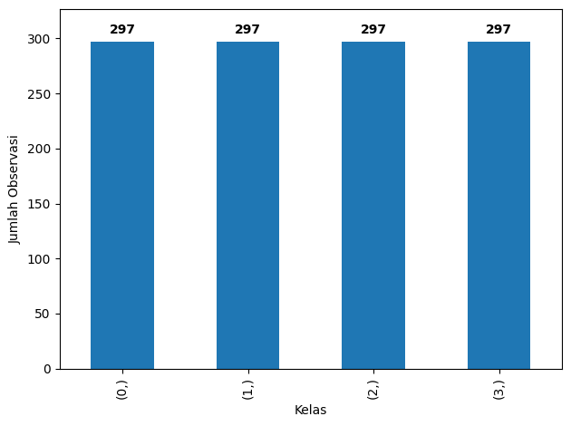

# Laporan Proyek Machine Learning - I Bagus Putu Swardanasuta

## Identitas
**Nama:** I Bagus Putu Swardanasuta  
**Email:** agusswardana123@gmail.com / a406ybm207@devacademy.id  
**ID Dicoding:** agusswardanaa

## Domain Proyek

Obesitas adalah penyakit tidak menular multifaktorial yang kompleks yang ditandai oleh kelebihan lemak tubuh yang dapat mengganggu kesehatan (World Health Organization, 2021). Obesitas menjadi salah satu faktor risiko utama penyakit tidak menular, seperti jantung koroner, stroke, dan diabetes tipe 2. Obesitas dapat disebabkan oleh beberapa faktor, yaitu genetik, akses fasilitas kesehatan, kesehatan mental, ekonomi, dan lingkungan. Upaya penanganan obesitas di Indonesia masih jarang dilakukan karena keterbatasan data yang tersedia. Hasil Survei Kesehatan Indonesia tahun 2023 mencatat prevalensi kegemukan dan obesitas hingga obesitas anak usia 13-15 tahun sebesar 16% dan hanya menurun sebesar 0,2% dari tahun 2013 (Badan Riset dan Inovasi Nasional, 2024).

Penanganan obesitas memerlukan dukungan data yang akurat untuk pengambilan keputusan yang tepat. Beberapa penelitian menemukan bahwa faktor penyebab obesitas sangat kompleks untuk dianalisis. Metode statistik tradisional seperti model linier masih terbatas pada analisis dengan jumlah variabel prediktor yang berkurang dan daya prediksi yang terbatas (Colmenarejo, 2020). Oleh karena itu, metode *machine learning* dapat menjadi alternatif untuk mengklasifikasikan obesitas berdasarkan variabel-variabel yang berhubungan. Penerapan *machine learning* pada bidang kesehatan dapat mendukung pengambilan keputusan, khususnya untuk mengurangi prevalensi obesitas dan overweight (Rodríguez et al., 2021).

Penelitian sebelumnya telah membangun model untuk memprediksi orang obesitas atau overweight menggunakan model *machine learning*. Penelitian (Rodríguez et al., 2021) menggunakan model random forest dengan akurasi sebesar 78%. Sementara itu, penelitian (Ferdowsy et al., 2021) menemukan bahwa model regresi logistik dapat mengklasifikasikan tingkat obesitas dengan akurasi mencapai 97,09%. Penerapan model *machine learning* dapat mengklasifikasikan obesitas dengan baik berdasarkan variabel yang kompleks dan jumlah observasi yang banyak.

Oleh karena itu, penelitian ini menggunakan variabel-variabel yang berkorelasi dengan obesitas untuk klasifikasi obesitas yang bertujuan untuk menyediakan insight bagi pemangku kepentingan dalam mencegah penyakit obesitas dengan akurat dan cepat.

## Business Understanding

Berdasarkan latar belakang masalah, pendefinisian permasalahan dan solusi yang diajukan adalah sebagai berikut.

### Problem Statements

- Penanganan obesitas di Indonesia masih kurang karena keterbatasan metode analisis untuk data yang kompleks.
- Tahap pemeriksaan obesitas memerlukan waktu yang lama dan biaya sehingga akan membutuhkan anggaran yang besar jika diterapkan pada banyak orang.
- Metode analisis yang lebih advanced diperlukan untuk mengklasifikasikan obesitas berdasarkan variabel yang berhubungan dan jumlah observasi yang banyak.
- Pemangku kebijakan dan masyarakat memerlukan sistem yang dapat memprediksi potensi obesitas dengan mudah.

### Goals

- Membangun model *machine learning* untuk klasifikasi obesitas berdasarkan variabel-variabel pendukung.
- Membandingkan kemampuan model *machine learning* untuk klasifikasi obesitas.
- Membandingkan kualitas data sebelum dan setelah penerapan teknik oversampling untuk menangani imbalance dataset.
- Membangun sebuah web prediksi obesitas seseorang.

### Solution statements

- Pembangunan model klasifikasi obesitas dilakukan menggunakan dataset Obesity Prediction. Klasifikasi dilakukan dengan membangun dua model yang akan dibandingkan berdasarkan metrik evaluasi klasifikasi, yaitu *accuracy*, *precision*, *recall*, dan *F1-score*.
- Penilaian kualitas data sebelum dan setelah penerapan teknik oversampling dievaluasi dengan membandingkan metrik evaluasi model sebelum dan setelah diterapkan *oversampling* pada dataset.
- Web prediksi obesitas dievaluasi dengan menggunakan *black box testing* untuk memastikan input dan output yang dihasilkan telah sesuai.

## Data Understanding
Dataset yang digunakan dalam proyek ini adalah Obesity Prediction dataset yang diperoleh melalui platform [Kaggle](https://www.kaggle.com/datasets/mrsimple07/obesity-prediction). Obesity Prediction dataset menyediakan koleksi atribut yang komprehensif yang terkait dengan demografi individu, kebiasaan gaya hidup, dan indikator kesehatan, yang bertujuan memfasilitasi prediksi prevalensi obesitas. Dataset ini menawarkan sumber daya yang berharga bagi para peneliti, ilmuwan data, dan profesional kesehatan yang tertarik untuk mengeksplorasi interaksi yang kompleks dari faktor-faktor yang berkontribusi terhadap obesitas dan mengembangkan strategi intervensi yang efektif.

Dataset memiliki 1000 observasi. Berdasarkan pengecekan awal, tidak terdapat *missing value* dan duplikasi data pada *dataset*. Oleh karena itu, *dataset* akan dieksplorasi lebih lanjut untuk mengetahui distribusinya.

### Variabel-variabel pada Obesity Prediction dataset adalah sebagai berikut:
- Age                   : usia individu (tahun)
- Gender                : jenis kelamin individu (laki-laki atau perempuan)
- Height                : tinggi badan individu (sentimeter)
- Weight                : berat badan individu (kilogram)
- PhysicalActivityLevel : tingkat aktivitas fisik individu
- ObesityCategory       : kategori obesitas (normal, overweight, obesitas, overweight)

### Exploratory data analysis
Untuk mengetahui distribusi masing-masing variabel, Gambar 1 menyajikan ringkasan statistik dari dataset yang digunakan.
  
Gambar 1. Ringkasan statistik dataset

- Fitur numerik memiliki sebaran yang berbeda-beda dan tidak terlihat nilai yang terlalu ekstrem.
- Observasi pada dataset didominasi oleh individu laki-laki.
- Individu dengan kategori normal weight lebih banyak pada dataset.

### Visualisasi data

#### Distribusi kelas target
Tahap penting dalam klasifikasi adalah memastikan distribusi kelas pada data untuk menghindari prediksi model yang dominan pada suatu kelas. Gambar 2 adalah visualisasi dari distribusi kelas.
  
Gambar 2. Distribusi kelas target

- Secara umum, kelas target memiliki distribusi yang tidak seimbang. Hal ini dapat menyebabkan model cenderung memprediksi kelas dominan saja.
- Kategori "normal weight" memiliki frekuensi paling banyak, sedangkan kategori "underweight" memiliki frekuensi paling sedikit,
- Kondisi ini harus dipertimbangkan untuk melatih model karena distribusi kelas yang tidak seragam sehingga dapat memengaruhi performa model.
- Oleh karena itu, dilakukan eksperimen dengan teknik oversampling SMOTE untuk melihat kemampuan model dalam mengklasifikasikan balanced dan imbalanced dataset.

#### Boxplot fitur numerik
Gambar 3 menyajikan sebaran dari fitur numerik untuk memastikan keseragaman data.
  
Gambar 3. Sebaran fitur numerik

- Boxplot menunjukkan sebaran yang bervariasi pada fitur numerik sehingga beberapa fitur dapat mendominasi untuk klasifikasi kelas.
- Fitur "Weight" memiliki beberapa pencilan yang lebih besar dari Q3.
- Pada tahap preprocessing harus dilakukan stadardisasi untuk memastikan keseragaman sebaran fitur numerik.

#### Korelasi fitur numerik
Dalam membangun model klasifikasi, hal penting yang harus diperiksa adalah hubungan antarfitur numerik. Gambar 4 menyajikan plot korelasi fitur numerik.
  
Gambar 4. Korelasi fitur numerik

- Plot korelasi menunjukkan hubungan antarfitur numerik sangat lemah dan tidak ada yang mendominasi satu sama lain.
- Kondisi ini sudah baik karena tidak ada multikolinieritas sehingga tidak ada fitur yang dapat menurunkan performa model karena terlalu dominan.

## Data Preparation

### 1. Encoding Fitur Kategorik
Pembangunan model *machine learning* mengharuskan semua fitur dalam bentuk numerik. Oleh karena itu, fitur kategorik harus dilakukan *encoding* agar dapat diproses dalam model. *Encoding* dilakukan pada pada fitur "Gender" dan target "ObesityCategory". Alasan dilakukan *encoding* adalah untuk menyiapkan data agar dapat diproses oleh model *machine learning*.

### 2. Data Splitting
Sebelum membangun model, dataset harus dibagi menjadi data *training* dan *testing* untuk menghindari model yang *overfit*. Pembagian data dilakukan dengan mempertimbangkan strata Y untuk mewakili setiap kelas target. Proporsi pembagian data *training* dan *testing* adalah 80/20.

### 3. Standardisasi Fitur Numerik
Hasil eksplorasi data menemukan bahwa fitur numerik memilliki distribusi yang berbeda. Oleh karena itu, fitur numerik distandardisasi dengan `StandardScaler` untuk memastikan kesamaan distribusi dengan rata-rata 0 dan standar deviasi 1. Standardisasi dilakukan untuk menghindari performa model yang buruk karena terdapat beberapa fitur yang terlalu mendominasi.

## Modeling
Proyek ini mengimplementasikan dua model *machine learning*, yaitu random forest dan support vector machine (SVM). Eksperimen dilakukan dengan membandingkan kemampuan model **sebelum dan setelah** penerapan SMOTE.

Algoritma random forest memiliki kelebihan dan kekurangan dalam tugas klasifikasi. Kelebihan random forest adalah dapat menghasilkan akurasi klasifikasi yang sangat tinggi, menentukan *variable importance*, menganalisi interaksi yang kompleks pada variabel prediktor (Cutler et al., 2007). Akan tetapi, random forest juga memiliki kelemahan, yaitu pengaruh *hyperparameter* yang sangat membingungkan. Model random forest yang terlalu kompleks akan menyebabkan *overfitting*, sedangkan model yang terlalu sederhana menyebabkan *undefitting* (Ao et al., 2019).

Algoritma SVM memiliki kelebihan karena kemampuannya dalam mengklasifikasikan data dengan akurasi tinggi serta dapat mengklasifikasikan data yang kompleks dan memiliki *noise* dengan model nonlinier (Bhavsar & Panchal, 2012). Sementara itu, kekurangan SVM adalah komputasi intensif, memerlukan memori yang besar jika data yang digunakan juga besar, dan pemilihan *hyperparameter* yang salah dapat menghasilkan model dengan performa yang buruk (Kirchner & Signorino, 2018).

Pelatihan model dalam proyek ini dilakukan dengan menerapkan *hyperparameter tuning* untuk meningkatkan akurasi model (Elgeldawi et al., 2021). Proyek ini menerapkan *random search* untuk menemukan konfigurasi *hyperparameter* terbaik. *Random search* menyediakan dasar alami yang dapat digunakan untuk mengukur kemajuan performa model (Ali et al., 2023).

Tabel 1 dan 2 menyajikan kandidat konfigurasi *hyperparameter* untuk model random forest dan SVM.

Tabel 1. Kandidat konfigurasi *hyperparameter* model random forest
| Parameter         | Nilai Range / Pilihan      |
| ----------------- | ------------------------   |
| n_estimators      | Random integer 100-500     |
| max_depth         | Random integer 5-50        |
| min_samples_split | Random integer 2-10        |
| min_samples_leaf  | Random integer 1-10        |
| max_features      | `'sqrt'`, `'log2'`, `None` |
| bootstrap         | `True`, `False`            |

Tabel 2. Kandidat konfigurasi *hyperparameter* model SVM
| Parameter   | Nilai Range / Pilihan   |
| ----------- | ----------------------- |
| C           | Uniform (0,1; 10)       |
| gamma       | Uniform (0,001; 1)      |
| kernel      | `'rbf'`, `'linear'`     |

### Sebelum Penerapan SMOTE

#### 1. Random Forest
Tabel 3 menyajikan konfigurasi *hyperparameter* terbaik model random forest.

Tabel 3. *Hyperparameter* terbaik model random forest
| Hyperparameter       | Nilai     |
|----------------------|-----------|
| bootstrap            | True      |
| max_depth            | 31        |
| max_features         | None      |
| min_samples_leaf     | 3         |
| min_samples_split    | 5         |
| n_estimators         | 154       |

Untuk memastikan performa model, dilakukan 5-cross validation. Rata-rata akurasi per *fold* adalah 0,935 yang menunjukkan performa model sudah baik.

#### 2. SVM
Pelatihan model SVM juga menerapkan *hyperparameter tuning* dengan *random search*. Konfigurasi *hyperparameter* terbaik disajikan pada Tabel 6.

Tabel 6. *Hyperparameter* terbaik model SVM
| Hyperparameter       | Nilai     |
|----------------------|-----------|
| C                    | 6,2185    |
| gamma                | 0,1405    |
| kernel               | linear    |

Hasil 5-cross validation model SVM menunjukkan rata-rata akurasi sebesar 0,9675. Hasil ini menunjukkan bahwa SVM memiliki performa yang lebih baik dibandingkan random forest.

### Setelah Penerapan SMOTE
*Imbalanced dataset* dapat menyebabkan performa model yang kurang baik karena model cenderung memprediksi kelas yang memiliki distribusi dominan. Oleh karena itu, proyek ini menerapkan teknik *oversampling* dengan SMOTE untuk menyamakan distribusi tiap kelas. Gambar 5 menyajikan distribusi kelas setelah penerapan SMOTE.

  
Gambar 5. Distribusi kelas setelah penerapan SMOTE

Penerapan SMOTE telah menyeimbangkan distribusi kelas pada data *training*. Selanjutnya, data telah siap dilakukan pemodelan.

#### 1. Random Forest
Tabel 5 menyajikan konfigurasi *hyperparameter* terbaik model random forest dengan *random search*.

Tabel 5. *Hyperparameter* terbaik model random forest
| Hyperparameter       | Nilai     |
|----------------------|-----------|
| bootstrap            | True      |
| max_depth            | 48        |
| max_features         | None      |
| min_samples_leaf     | 3         |
| min_samples_split    | 2         |
| n_estimators         | 491       |

Berdasarkan hasil 5-cross validation, model random forest memiliki rata-rata akurasi sebesar 0,9596. Skor ini menunjukkan bahwa terdapat peningkatan performa model setelah penerapan SMOTE.

#### 2. SVM
Konfigurasi *hyperparameter* terbaik model SVM disajikan pada Tabel 4.

Tabel 6. *Hyperparameter* terbaik model SVM
| Hyperparameter       | Nilai     |
|----------------------|-----------|
| C                    | 9,8376    |
| gamma                | 0,2338    |
| kernel               | linear    |

Berdasarkan 5-cross validation, model SVM memiliki rata-rata akurasi sebesar 0,9840. Hal ini juga menunjukkan bahwa performa mengalami peningkatan setelah penerapan SMOTE.

### Pemilihan Model Terbaik
Hasil 5-cross validation pada setiap percobaan menunjukkan bahwa model SVM dengan penerapan SMOTE memiliki rata-rata akurasi paling tinggi, yaitu sebesar 0,9840. Oleh karena itu, model SVM dengan penerapan SMOTE dipilih sebagai model terbaik.

## Evaluation
Setelah pembangunan model *machine learning*, model harus dievaluasi pada data *testing* untuk memastikan keandalannya pada data yang belum dikenal. Proyek ini menggunakan 4 metrik evaluasi pada tugas klasifikasi, yaitu akurasi, *precision*, *recall*, dan *F1-score* (Vujović, 2021). Semua metrik yang digunakan memiliki rentang nilai 0 sampai 1, 0 berarti model salah mengklasifikasikan semua data, sedangkan 1 berarti model benar mengklasifikasikan seluruh data. Evaluasi pada tugas klasifikasi didasarkan pada *confusion matrix* yang diilustrasikan pada Gambar 6.

  
Gambar 6. *Confusion matrix*

**1. Akurasi**  
Akurasi adalah jumlah dua prediksi akurat dibagi dengan jumlah total set data. Akurasi bekerja dengan mengukur seberapa banyak prediksi model yang benar dibandingkan dengan total jumlah prediksi yang dilakukan. Formula akurasi adalah
$$
\text{Akurasi} = \frac{TP + TN}{TP + TN + FP + FN}.
$$

**2. _Precision_**
*Precision* adalah jumlah prediksi positif yang benar, dibagi dengan jumlah positif pada *predicted class*. *Precision* mengukur seberapa akurat prediksi positif yang dibuat oleh model sehingga penting saat kasus *false positive* yang sangat merugikan, seperti deteksi penyakit langka. Formula *precision* adalah
$$
\text{Precision} = \frac{TP}{TP + FP}.
$$

**3. _Recall_**  
*Recall* adalah jumlah prediksi positif yang akurat dibagi dengan jumlah positif pada *actual class*. *Recall* mengukur seberapa banyak kasus positif yang berhasil ditemukan oleh model dari semua kasus positif yang sebenarnya ada sehingga penting saat *false negative* merugikan, seperti filter spam. Formula *recall* adalah
$$
\text{Recall} = \frac{TP}{TP + FN}.
$$

**4. _F1-Score_**  
*F1-score* adalah ukuran keakuratan pengujian yang diusur berdasarkan *precision* dan *recall*. *F-1 score* bekerja dengan menyeimbangkan *precision* dan *recall* sehingga mempertimbangkan semua kelas. Formula *F1-score* adalah
$$
\text{F1} = 2 \cdot \frac{\text{Precision} \cdot \text{Recall}}{\text{Precision} + \text{Recall}}.
$$

Evaluasi dilakukan pada 4 skenario, yaitu model random forest dan SVM sebelum dan setelah penerapan SMOTE. *Confusion matrix* pada data *testing* disajikan pada Gambar 7.

  
Gambar 7. *Confusion matrix* pada data *testing*

- Gambar 7 menunjukkan bahwa model random forest sebelum penerapan SMOTE banyak mengalami salah prediksi. Model SVM sebelum SMOTE sudah cukup baik dalam memprediksi, tetapi masih terdapat kesalahan pada beberapa kelas.
- Setelah penerapan SMOTE, model random forest lebih baik dalam memprediksi, sedangkan model SVM hanya salah memprediksi pada 2 observasi saja.

Hasil evaluasi dengan metrik evaluasi klasifikasi disajikan pada Tabel 7.

Tabel 7. Hasil evaluasi model
| Model               | Accuracy | Precision | Recall | F1-Score |
|---------------------|----------|-----------|--------|----------|
| Random Forest       | 0,940    | 0,940     | 0,940  | 0,940    |
| SVM                 | 0,985    | 0,985     | 0,985  | 0,985    |
| Random Forest SMOTE | 0,950    | 0,950     | 0,950  | 0,949    |
| SVM SMOTE           | 0,990    | 0,990     | 0,990  | 0,990    |

- Hasil evaluasi pada Tabel 7 menunjukkan bahwa penerapan SMOTE dapat meningkatkan kemampuan model dalam klasifikasi.
- Model SVM memiliki performa yang lebih baik dibandingkan random forest, baik sebelum dan setelah penerapan SMOTE. Hal ini menunjukkan SVM lebih baik dalam mengklasifikasikan obesitas.
- Model terbaik yang dipilih saat modeling, yaitu SVM dengan SMOTE memiliki akurasi sebesar 0,990 pada data *testing*, artinya model hampir sempurna dalam mengklasifikasika obesitas.
- Model yang dibangun pada proyek ini telah memiliki performa yang sangat baik dan siap digunakan untuk *deployment* dengan membuat web prediksi.

## Deployment
Tahap akhir dari proyek ini adalah mengimplementasikan model yang telah dibuat ke dalam sebuah web prediksi untuk membantu pemangku kepentingan dan masyarakat dalam memprediksi obesitas dengan mudah. Web prediksi dibangun dengan *framework* Gradio dan dapat diakses [di sini](https://agusswardanaa-obesity-prediction.hf.space).

### Tampilan Web Prediksi
  
Gambar 8. Tampilan web prediksi

### Evaluasi *Black Box Testing*
Web prediksi yang telah dibangun dievaluasi dengan *black box testing* untuk memastikan web menghasilkan output yang benar berdasarkan input dari pengguna. Tabel 8 menyajikan hasil pengujian *black box*.

Tabel 8. Hasil *black box testing*
| Input (age, gender, height, weight, BMI, physical activity level) | Output        | Keterangan |
|-------------------------------------------------------------------|---------------|------------|
| 20, Male, 170, 40, 2                                              | Underweight   | Sukses     |
| 25, Male, 168, 105, 1                                             | Obese         | Sukses     |  
| 37, Female, 160, 70, 3                                            | Overweight    | Sukses     |
| 50, Female, 165, 60, 4                                            | Normal weight | Sukses     |
| 10, Male, 150, 40, 3                                              | Underweight   | Sukses     |

## Daftar Pustaka
1. Ali, Y. A., Awwad, E. M., Al-Razgan, M., & Maarouf, A. (2023). Hyperparameter Search for Machine Learning Algorithms for Optimizing the Computational Complexity. Processes 2023, Vol. 11, Page 349, 11(2), 349. https://doi.org/10.3390/PR11020349
2. Ao, Y., Li, H., Zhu, L., Ali, S., & Yang, Z. (2019). The linear random forest algorithm and its advantages in machine learning assisted logging regression modeling. Journal of Petroleum Science and Engineering, 174, 776–789. https://doi.org/10.1016/J.PETROL.2018.11.067
3. Badan Riset dan Inovasi Nasional. (2024, May 31). Tantangan dan Strategi Penanganan Obesitas Pada Anak dan Remaja. https://brin.go.id/reviews/118905/tantangan-dan-
4. Bhavsar, H., & Panchal, M. H. (2012). A Review on Support Vector Machine for Data Classification. International Journal of Advanced Research in Computer Engineering & Technology (IJARCET), 1(10), 2278–1323.
5. Colmenarejo, G. (2020). Machine Learning Models to Predict Childhood and Adolescent Obesity: A Review. Nutrients 2020, Vol. 12, Page 2466, 12(8), 2466. https://doi.org/10.3390/NU12082466
6. Cutler, D. R., Edwards, T. C., Beard, K. H., Cutler, A., Hess, K. T., Gibson, J., & Lawler, J. J. (2007). Random forests for classification in ecology. Ecology, 88(11), 2783–2792. https://doi.org/10.1890/07-0539.1;SUBPAGE:STRING:ABSTRACT;WEBSITE:WEBSITE:ESAJOURNALS;REQUESTEDJOURNAL:JOURNAL:19399170;JOURNAL:JOURNAL:19399170;WGROUP:STRING:PUBLICATION
7. Elgeldawi, E., Sayed, A., Galal, A. R., & Zaki, A. M. (2021). Hyperparameter Tuning for Machine Learning Algorithms Used for Arabic Sentiment Analysis. Informatics 2021, Vol. 8, Page 79, 8(4), 79. https://doi.org/10.3390/INFORMATICS8040079
8. Ferdowsy, F., Rahi, K. S. A., Jabiullah, M. I., & Habib, M. T. (2021). A machine learning approach for obesity risk prediction. Current Research in Behavioral Sciences, 2, 100053. https://doi.org/10.1016/J.CRBEHA.2021.100053
9. Kirchner, A., & Signorino, C. S. (2018). Using Support Vector Machines for Survey Research. Survey Practice, 11(1), 1–14. https://doi.org/10.29115/SP-2018-0001
10. Rodríguez, E., Rodríguez, E., Nascimento, L., Da Silva, A., & Marins, F. (2021, November 19). Machine learning techniques to predict overweight or obesity. 4th International Conference on Informatics & Data-Driven Medicine.
11. Vujović, Ž. (2021). Classification Model Evaluation Metrics. International Journal of Advanced Computer Science and Applications, 12(6), 599–606. https://doi.org/10.14569/IJACSA.2021.0120670
12. World Health Organization. (2021). Draft Recommendations for the Prevention and Management of Obesity Over the Life Course, Including Potential Targets. https://doi.org/10.1017/S2040174421000027